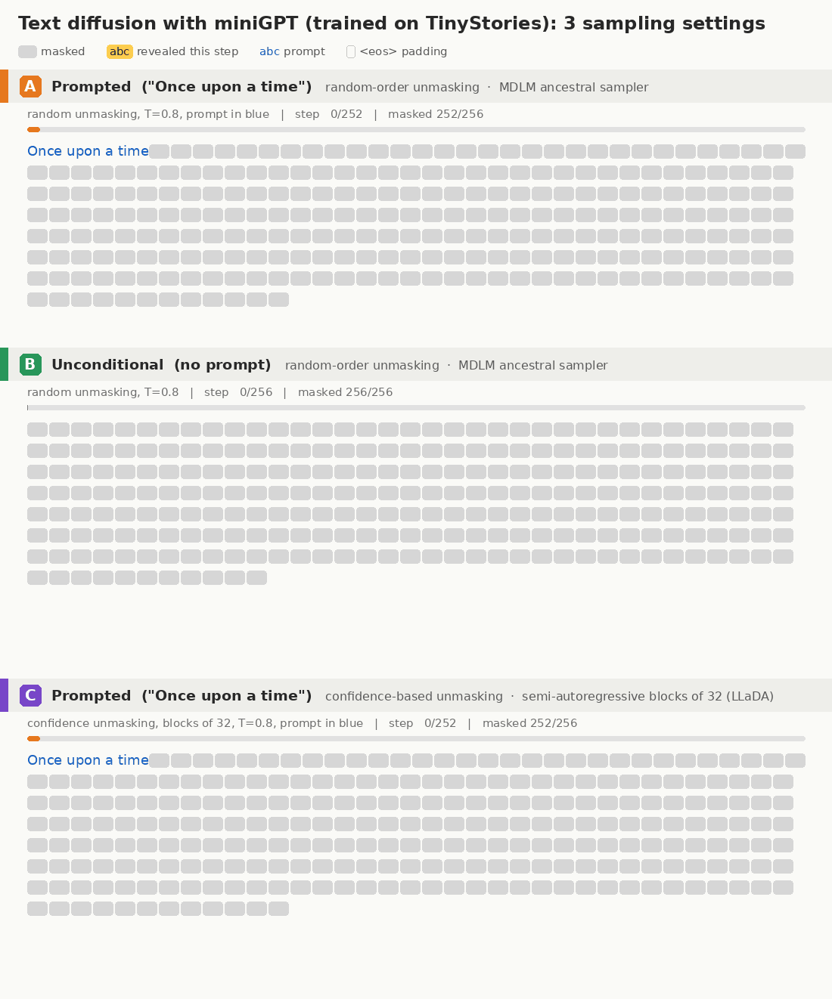
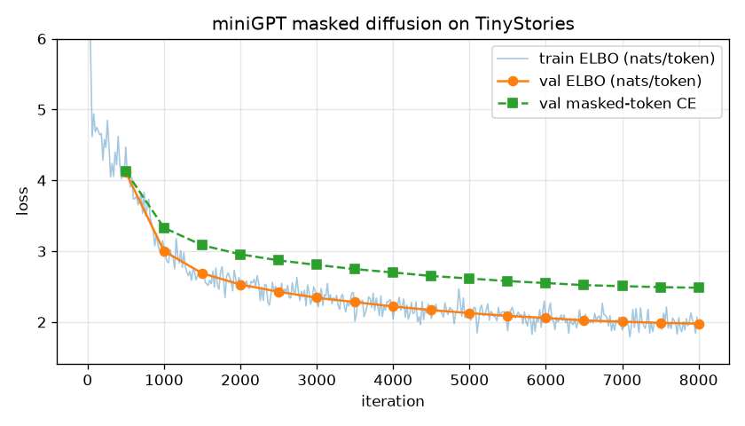

# dllm — a tiny text-diffusion model (miniGPT) trained on TinyStories

A from-scratch PyTorch implementation of a **masked discrete diffusion language
model** (the MDLM / LLaDA recipe). The denoiser is a **miniGPT** — a shrunk-down GPT-2
written from scratch (no `transformers` import). The model is trained on
[TinyStories](https://huggingface.co/datasets/roneneldan/TinyStories).



Generation goes from a fully masked 256-token canvas to a finished story, one token per step:

- **A** — prompted with "Once upon a time", random-order unmasking
- **B** — unconditional (no prompt), random-order unmasking
- **C** — prompted, confidence-based unmasking with semi-autoregressive blocks of 32 (LLaDA-style)

## How it works

| | Autoregressive GPT-2 | This model (masked diffusion) |
|---|---|---|
| Attention | causal | **bidirectional** (`is_causal=False`) |
| Corruption | — | each token → `<mask>` with prob. `t ~ U(0,1)` |
| Training loss | next-token CE | `(1/t) · CE on masked tokens` (continuous-time ELBO) |
| Generation | left → right, 1 token / step | start from all `<mask>`, reveal ~`L/steps` tokens per step, in any order |

**Sampling.** We start from a fully masked 256-token canvas. Each step the model predicts
every masked position, and we commit the most confident predictions (`--strategy confidence`, as in
LLaDA) or a random subset (`--strategy random`, the vanilla MDLM sampler). Stories are right-padded with
`<eos>` during training, so the model also decides *where the story ends* (the small outlined boxes in the GIF).

**miniGPT config** (default): 6 layers, 6 heads, 384-d embeddings, 256 context, learned positional
embeddings, pre-LayerNorm, GELU MLP, tied input/output embeddings — ~13.8M params.

**Tokenizer.** GPT-2 BPE (via `tiktoken`) remapped to the 8,189 most frequent TinyStories tokens + 3
specials (`<eos>`, `<mask>`, `<unk>`). This covers 99.8% of tokens and makes the softmax ~6× cheaper.

## Files

| File | Purpose |
|---|---|
| [`model.py`](model.py) | miniGPT (bidirectional GPT-2) from scratch |
| [`diffusion.py`](diffusion.py) | forward masking process, ELBO loss, iterative-unmasking sampler |
| [`data.py`](data.py) | TinyStories download/tokenization, compact tokenizer |
| [`train.py`](train.py) | training loop (AdamW, warmup + cosine LR, eval, checkpoints) |
| [`visualize.py`](visualize.py) | sample + render the denoising trajectory as a GIF |
| [`plot_loss.py`](plot_loss.py) | training / validation curves |
| [`stack_gifs.py`](stack_gifs.py) | stack the three GIFs into one labelled comparison GIF |

## Usage

```bash
pip install torch tiktoken pyarrow numpy pillow matplotlib huggingface_hub

python data.py                       # -> data/{train,val}.bin, data/vocab.json
python train.py                      # -> out/ckpt.pt, out/log.jsonl  (CPU: ~0.8 s/iter)
python plot_loss.py                  # -> assets/loss.png

# GIFs (default: random-order unmasking, 256 steps = 1 token / step)
python visualize.py --prompt "Once upon a time" --seed 3 --out assets/diffusion_prompt.gif
python visualize.py --seed 2 --out assets/diffusion_uncond.gif
python visualize.py --prompt "Once upon a time" --strategy confidence --block_len 32 --seed 1 \
    --out assets/diffusion_block_confidence.gif
python stack_gifs.py                 # -> assets/diffusion_stacked.gif (A/B/C comparison)
```

GIF legend: grey box = `<mask>`, yellow = tokens revealed at this step, blue = prompt,
outlined box = `<eos>` padding.

## Results

Trained on CPU (24 threads, fp32) for 8,000 iterations × 64 stories × 256 tokens (~131M tokens,
~1h45m, first 1 of the 4 train shards ≈ 530k stories).

| | value |
|---|---|
| final val ELBO | **1.98 nats/token** (perplexity upper bound ≤ 7.2) |
| final val masked-token CE | 2.48 |



### Sampler matters

| sampler | behaviour |
|---|---|
| `random` (MDLM ancestral, default) | diverse, full-length stories; occasional local incoherence |
| `confidence`, whole sequence | **collapses to ~40-token stories**: trailing `<eos>` padding is the most confident prediction, so it is committed first and squeezes the story |
| `confidence` + `--block_len 32` (LLaDA semi-AR) | fluent and long, but repetitive / low diversity ("Lily … mommy … park") |

Sample (random unmasking, prompt "Once upon a time"):

> Once upon a time, there was a lazy bear. He was very tired because he always wanted to explore fun
> places. One day, he stumbled on his hole and fell into the ground and ran right inside. Then he saw
> the door and felt very wet. He looked around the room and got dark and sparkled on the ground. …
